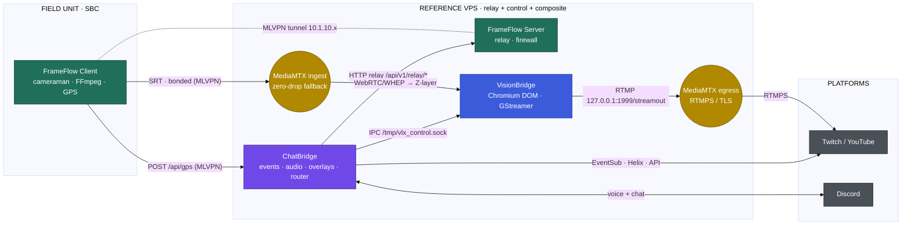

# Architecture — VLX ChatBridge

> **Part of the VLX Stream Flow ecosystem — Control & Engagement tier.**
> This document details ChatBridge's internal design and its contracts with the sibling services **VLX FrameFlow** and **VLX VisionBridge**.

VLX ChatBridge is a unified, self-hosted Go application that bridges streaming-platform events (Twitch, YouTube) with Discord audio and video/audio overlays, orchestrated by a central core around **six hot-swappable modules**. Within the ecosystem it is the control plane: the router that turns chat commands and platform events into IPC and HTTP-relay actions, and the sink for FrameFlow telemetry.

---

## The VLX Stream Flow ecosystem

VLX Stream Flow is a self-hosted, end-to-end broadcasting stack composed of three cooperating services:

| Project | Tier | Responsibility | |
| :--- | :--- | :--- | :--- |
| **VLX FrameFlow** | Edge & Transport | Bonded uplink (MLVPN + MPTCP), SBC multi-camera SRT encode, GPS telemetry, VPS relay | |
| **VLX VisionBridge** | Composition | Headless Chromium-DOM scene compositor + GStreamer capture → MediaMTX restream | |
| **VLX ChatBridge** | Control & Engagement | Twitch/YouTube events, Discord audio gateway, overlays, and the ecosystem command router | **← this repository** |



### Reference topology

The reference deployment is a **single VPS** that co-hosts the FrameFlow Server, ChatBridge, and VisionBridge (each with its MediaMTX role), reachable from the SBC over the MLVPN tunnel (`10.1.10.x`). Components may be split across hosts; the contracts below are host-agnostic.

---

## VLX Stream Flow contracts

> These four contracts are **normative for the whole ecosystem** and are reproduced verbatim in each project's `ARCHITECTURE.md`. Change them in lockstep across all three repositories.

### Canonical port & endpoint map

| Service | Component | Bind (default) | Purpose |
| :--- | :--- | :--- | :--- |
| FrameFlow | Client API (Gin) | `9090` | `/api/<module>/…` on the SBC |
| FrameFlow | Server relay | `127.0.0.1:9090` | `/api/v1/relay/*`, `/api/v1/peer/:id/*` |
| FrameFlow | Frontend (Svelte) | `8080` | Control panel + telemetry WS `/ws` |
| FrameFlow | MediaMTX ingest | SRT `8890` · RTMP `1935` · RTMPS `1936` · WebRTC `8889` · API `127.0.0.1:9997` | `cameraman` / `wificam` paths |
| FrameFlow | gpsd | `1198` | local GPS daemon |
| ChatBridge | Server (overlays + GPS ingest) | `8000` (test `8001`) | overlays, `POST /api/gps` |
| ChatBridge | Control API | `127.0.0.1:8760` | management REST + console WS |
| ChatBridge | Frontend (Svelte) | `8090` | GUI → control API |
| ChatBridge | Connector | `/tmp/vlx_control.sock` | IPC **writer** → VisionBridge |
| VisionBridge | Control API | `127.0.0.1:8770` | management REST + console WS |
| VisionBridge | Frontend (Svelte) | `8091` | GUI → control API |
| VisionBridge | Overlay/WS server | `50051` (WebRTC `50000–50050`) | Chromium DOM sync |
| VisionBridge | Connector | `/tmp/vlx_control.sock` | IPC **listener** ← ChatBridge |
| VisionBridge | MediaMTX egress | RTMP `1999` · RTMPS `1936` · SRT `8890` | `streamout` restream |

> ⚠️ **Co-location deconfliction:** on the single-VPS reference topology the FrameFlow ingest MediaMTX and the VisionBridge egress MediaMTX **both** default to RTMPS `1936` and SRT `8890`. Assign distinct ports per instance (e.g. move VisionBridge's MediaMTX RTMPS to `1937` / SRT to `8891`) before running them on the same host.

### 1. Connector (IPC) contract — ChatBridge → VisionBridge

Transport: **newline-delimited JSON over a Unix domain socket** (`/tmp/vlx_control.sock`). ChatBridge is the writer (`connector.ipc_control_out`); VisionBridge is the listener (`connector.ipc_control_in`). *(There is no ZeroMQ; the legacy token `[ZMQ_CONTROL]` is retained only for backward compatibility in command files.)*

Envelope:

```json
{ "event_id": "uuid", "timestamp": 1700000000, "action": "…", "target": "…", "payload": { "enabled": true, "text": "…" } }
```

| `action` | `target` | `payload` | Effect on VisionBridge |
| :--- | :--- | :--- | :--- |
| `set_input_state` | `stream` | `{enabled}` | Enable/disable output; disabling SIGKILLs FFmpeg. |
| `set_input_state` | `overlay@layerN` | `{enabled, text=path}` | Toggle Z-layer *N*; set its path when enabling. |
| `set_input_state` | `volume@layerN` | `{text="0..100"}` | Set Z-layer *N* volume (live, no restart). |
| `reload` | `chromium` | `{}` | Restart the Chromium DOM engine. |
| `apply_template` | — | `{text=template_filename}` | Apply a stored Z-layout template. |

**Known limitation (see incongruousness log):** ChatBridge's `[ZMQ_CONTROL]`/`ipc_control` parser only forwards the `text`/`path` field for `set_input_state`; `apply_template` cannot yet carry its template name from ChatBridge, and pass-through events emitted as `trigger_event` are not recognised by VisionBridge. Drive `apply_template` over the socket directly until the parser is extended.

### 2. Command / webhook contract — ChatBridge → FrameFlow

ChatBridge reaches the SBC through the FrameFlow **Server relay**, never the SBC API directly:

```
POST http://127.0.0.1:9090/api/v1/relay/<path>      →  MLVPN  →  SBC /api/<path>
```

Valid `<path>` verbs (Client API): `frameflow/client/{start,stop,status,reset}`, `frameflow/ap/{start,stop,status}`, `frameflow/bonding/{start,stop,status}`, `cameraman/{start,stop,status,list-dev}`, `mediamtx/{start,stop,status}`, `gps/{start,stop,status}`. Example: `POST /api/v1/relay/cameraman/start` with `{"device":"V0A1"}`.

### 3. GPS telemetry contract — FrameFlow → ChatBridge

The SBC GPS sender POSTs, at ~1 msg / 5 s, to `gps_target_url` (the ChatBridge `POST /api/gps` receiver, typically `http://10.1.10.1:8000/api/gps` over MLVPN). Body:

```json
{ "lat": 0.0, "lon": 0.0, "alt": 0.0, "pos_error": 0.0, "speed": 0.0 }
```

ChatBridge re-wraps this as `{"type": "<overlay.gps.event_type|gps>", "data": {…}}` and broadcasts it over WebSocket to `gps_overlay.html` (which also accepts the legacy type `gps_update`) at 60 fps. The endpoint is unauthenticated by design; Layer-3 MLVPN isolation secures it.

### 4. Media-path contract — FrameFlow → VisionBridge

SBC cameras → FrameFlow Client FFmpeg **SRT (bonded, MLVPN)** → FrameFlow Server **MediaMTX** (`cameraman`/`wificam`, SRT `8890`, zero-drop `/offline` fallback) → VisionBridge consumes the feed as a **Chromium Z-layer** (a WebRTC/WHEP or iframe URL pointing at the ingest MediaMTX) → VisionBridge composites and restreams onward. *(ChatBridge is not on the video path; it controls it.)*

---

## Modules

A central `ModuleManager` (`internal/core/module`) exposes a `module.Controller` interface for asynchronous lifecycle events and hot-swapping without circular dependencies. Each module uses a fresh per-start stop channel so it can be toggled repeatedly at runtime.

1. **ChatFlow** — event ingestion, logic, overlay coordination.
   - Twitch EventSub (follows/subs/raids) + IRC client (`gempir/go-twitch-irc/v4`) for chat commands.
   - Cross-platform Discord go-live/stream-end announcer (SQLite-backed dedup + rich embeds; `combine_window` coalescing).
   - First-Chatter tracker (floats a user's first message of the session).
   - YouTube polling (Super Chats, Stickers, Memberships).
   - Shared `PresenceTracker` across Twitch/YouTube for watch-checks.
   - Overlay management (Alerts, Chat Media, Emote Wall, GPS, Scenes) with per-target audio routing and volume.
   - WebSocket Hub (`*websocket.Hub`) for OBS Browser Sources (strict path validation, Go 1.24+ `ServeMux`).
   - Built-in commands `!followage` and `!lottery`.
2. **AudioBridge** — Discord integration (`disgo`), E2EE via `godave`/`libdave`, Opus ingest (`hraban/opus.v2`), PCM egress (`DiscordPCMSender`), slash commands `/commands` and `/run`.
3. **Server** — HTTP routing (`http.ServeMux`), static overlays, template injection (`window.VLX_CONFIG`, `{{.WebsocketPath}}`, `{{.AssetPrefix}}`), `path_prefix` handling with proxy-header detection, `test_port` alert testing, and the **`POST /api/gps`** telemetry receiver.
4. **Streaming** — `SRTManager` pipes mixed PCM via `stdin` to `ffmpeg` (`fifo` muxer for infinite reconnects).
5. **AudioSource** — external feeds decoded to PCM (s16le, 48 kHz, stereo) into `audio.PCMChannel`.
6. **Connector** — Unix domain socket **writer**; drains `events.ControlBroadcastChan`, maps to the [Connector contract](#1-connector-ipc-contract--chatbridge--visionbridge) envelope, and writes newline-delimited JSON. Enabled by `connector.ipc_control_out`.

## Control API & Web GUI

`ControlAPI` is always-on and independent of the hot-swappable modules: Basic-Auth REST (`/api/status`, `/api/module`, `/api/feature`, `/api/shutdown`) on `bind_address:port` (default `127.0.0.1:8760`), plus an on-demand `journalctl` console over WebSocket (spawned per connection, authorised via short-lived tickets; target unit from `ControlAPI.LogUnit`). Module state changes are persisted to the YAML settings file (node-tree edits preserve comments and `${ENV}` refs) without disrupting the control layer. The optional `VLX_ChatBridge_frontend` binary reverse-proxies a Svelte 5 SPA to this API.

## Telemetry pipeline

Replaces the legacy PHP/Apache polling model. **Sender:** FrameFlow POSTs JSON to `POST /api/gps` over MLVPN. **Security:** no app-level auth — Layer-3 MLVPN isolation secures it. **Receiver:** `internal/modules/server/module.go` parses the payload in RAM and pushes a `{type, data}` event to the WebSocket hub. **Display:** `static/gps_overlay.js` renders in real time at 60 fps.

## Command routing (IPC & webhooks)

`ChatFlow` parses files in `static/chat/` into a command map (built synchronously, swapped atomically, guarded by `sync.RWMutex` for safe hot-reload):

- `[ZMQ_CONTROL]` block → tagged `ipc_control` → routed to the Connector.
- `[WEBHOOK]` block → asynchronous HTTP POST to the FrameFlow relay.
- `AutoDelete` → a Helix API delete using the DB-refreshed broadcaster token (`GetTwitchCredentials`), falling back to the static config token only if the DB lookup fails.

Commands are routed asynchronously via `events.ControlBroadcastChan` so the chat loop never blocks; the `Connector` intercepts these broadcasts for downstream IPC.

## Audio architecture

Direct internal decoding replaces headless browser capture. **Decoding:** FFmpeg (`audio.DecodeMediaToPCM`) → 48 kHz stereo 16-bit PCM. **Routing:** a shared singleton `PCMChannel` fans out (`internal/core/audio/pipe.go`) to `SRTChannel` and `DiscordChannel` per `RouteSRT`/`RouteDiscord`. **Mixing:** independent `audio.Mixer` instances per output prevent echoing a Discord participant back to themselves, applying equal-power balancing, noise gating, feed-forward compression, and soft-clip limiting.

## Database

SQLite (`chatbridge.db` in `$chatbridge_DIR/var/`) via `database/sql` + `github.com/mattn/go-sqlite3`. Tables include `twitch_credentials`, `twitch_subscriptions`, `youtube_state`, `announce_log`.

## Dependency management

- Discord: `github.com/disgoorg/disgo` (with `voice.WithDaveSessionCreateFunc(golibdave.NewSession)`).
- E2EE voice: `github.com/disgoorg/godave/golibdave` (local `libdave` v1.1.0).
- Twitch IRC: `github.com/gempir/go-twitch-irc/v4`.
- Opus: `gopkg.in/hraban/opus.v2`.

---

<sub>VLX ChatBridge is part of the **VLX Stream Flow** ecosystem · [FrameFlow](https://github.com/viruslox/VLX_FrameFlow) · [VisionBridge](https://github.com/viruslox/VLX_VisionBridge) · [ChatBridge](https://github.com/viruslox/VLX_ChatBridge)</sub>
