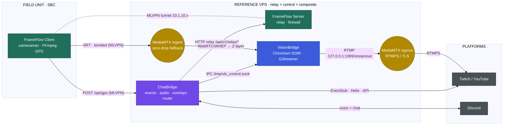

# VLX ChatBridge

> **Part of the [VLX Stream Flow](#the-vlx-stream-flow-ecosystem) ecosystem — the Control & Engagement tier.**
> A unified, self-hosted Go backend that fuses Twitch/YouTube events, a bi-directional Discord audio gateway, and overlay management — and acts as the ecosystem's command router.

VLX ChatBridge integrates streaming-platform events (Twitch, YouTube) with a Discord audio gateway and an overlay system. It is a merge of **VLX_ChatFlow** (OBS alert overlays) and **VLX_AudioBridge** (Discord-to-SRT audio gateway).

> **NOTE:** The idea, logic, architecture, review, and validation were created by VirusLox, with code generation assisted by AI.

For the full system design, see **[docs/ARCHITECTURE.md](ARCHITECTURE.md)**.

---

## The VLX Stream Flow ecosystem

VLX ChatBridge is one of three cooperating services in the **VLX Stream Flow** ecosystem — an end-to-end, self-hosted stack for IRL and studio broadcasting that runs from the field camera all the way to the streaming platform.

| Project | Tier | Responsibility | |
| :--- | :--- | :--- | :--- |
| **[VLX FrameFlow](https://github.com/viruslox/VLX_FrameFlow)** | Edge & Transport | Bonded uplink (MLVPN + MPTCP), SBC multi-camera SRT encode, GPS telemetry, VPS relay | |
| **[VLX VisionBridge](https://github.com/viruslox/VLX_VisionBridge)** | Composition | Headless Chromium-DOM scene compositor + GStreamer capture → MediaMTX restream | |
| **[VLX ChatBridge](https://github.com/viruslox/VLX_ChatBridge)** | Control & Engagement | Twitch/YouTube events, Discord audio gateway, overlays, and the ecosystem command router | **← this repository** |



**ChatBridge's role in the ecosystem:** ChatBridge is the control and engagement plane. It ingests platform events and chat commands and routes them outward: **IPC (Unix socket)** to VisionBridge for zero-latency scene control, and **HTTP relay calls** to FrameFlow for IRL backpack control. It is also the **telemetry sink** — the SBC POSTs GPS/speed data to ChatBridge, which broadcasts it to overlays at 60 fps. The canonical inter-service contracts are specified in **[docs/ARCHITECTURE.md → VLX Stream Flow contracts](docs/ARCHITECTURE.md#vlx-stream-flow-contracts)**.

---

## Unified architecture

ChatBridge runs as a single binary with **six** independently configurable, hot-swappable modules over a shared core:

1. **ChatFlow** — Twitch EventSub webhooks + YouTube polling; visual alerts, chat media commands, emote-wall physics; cross-platform Discord go-live announcer.
2. **AudioBridge** — joins Discord voice channels, captures incoming audio, mixes it with internal ChatFlow audio, and pipes the resulting PCM.
3. **Server** — HTTP/WebSocket server for OBS Browser Sources; hosts frontend overlays; **receives FrameFlow GPS telemetry** at `POST /api/gps`.
4. **Streaming** — SRT egress of mixed audio via FFmpeg.
5. **AudioSource** — ingests external audio feeds (e.g. internet radio) via FFmpeg into the internal mixer.
6. **Connector** — local IPC (Unix domain socket) that streams JSON control events to **VLX VisionBridge**.

All six modules can be toggled on the fly via the `modules` block, so the server can act as an alert system, an audio bridge, an SRT streamer, an IPC connector, or any combination.

---

## Features

### ChatFlow
- **Twitch:** EventSub webhooks (follows, subs, raids) + IRC bot with role-based `!commands`.
- **First-Chatter Float:** floats a user's name across the screen the first time they chat in a live session, colored to match their Twitch name.
- **YouTube:** live polling for Super Chats, Stickers, Memberships.
- **Overlays:** Alerts, Chat Media, Emote Wall, GPS, and Scenes.
- **Smart rate limiting & persistence:** token buckets for API quotas; SQLite for state/tokens.
- **Dynamic command generation:** drop files into permission folders (`everyone`, `subscribers`, `vips`); the `owner_` prefix enforces broadcaster-only access.
- **Ecosystem command routing:** chat commands route via **IPC** to VisionBridge (scene control) and via **HTTP relay** to FrameFlow (backpack control).

### Advanced audio engine
Direct internal audio decoding, dynamic equal-power volume balancing, envelope-based noise gating, a zero-latency feed-forward compressor, and soft-clip peak limiting.

### Real-time telemetry (GPS)
ChatBridge receives GPS/speed data from the FrameFlow backpack (`POST /api/gps`) and broadcasts it to overlays over WebSocket at 60 fps — no disk I/O, DB checks, or HTTP polling. To display it in VisionBridge, add a Chromium Z-layer pointing at `http://127.0.0.1:8000/gps_overlay.html`.

### AudioBridge
Discord ingress/egress (Opus capture, `libdave`/`godave` E2EE support), soft-clipping PCM mixer, SRT streaming via FFmpeg, and direct injection of `.mp3`/`.wav` chat-command media into Discord and the SRT stream.

---

## Project structure

```text
VLX_ChatBridge/
├── cmd/
│   ├── chatbridge/main.go        # Entry point. Initializes core and starts modules.
│   └── frontend/main.go          # Standalone Svelte GUI reverse proxy.
├── internal/
│   ├── core/                     # Shared components (config, logger, db, audio, module manager, events)
│   └── modules/
│       ├── chatflow/             # Twitch, YouTube, WebSockets, overlays, command routing
│       ├── audiobridge/          # Discord bot + voice
│       ├── server/               # HTTP webserver, /api/gps, reverse-proxy mapping
│       ├── streaming/            # SRT output mixing via FFmpeg
│       ├── audiosource/          # External audio ingest
│       └── connector/            # Local IPC to VisionBridge
├── static/                       # Frontend overlays (HTML/JS/CSS) + chat/ command assets
└── config/                       # Configuration templates
```

---

## System requirements
- **OS:** Linux (tested on Debian).
- **Dependencies:** Go 1.24+, SQLite, FFmpeg, libopus-dev, libopusfile-dev, pkg-config, cmake, clang, build-essential.
- *PortAudio and Chromium dependencies previously required by AudioBridge have been removed in favor of direct internal audio decoding.*

## Installation & build

### 1. Install libdave (Discord voice E2EE)
```bash
mkdir -p ~/Projects/ && cd ~/Projects/
git clone https://github.com/disgoorg/godave.git
cd godave/scripts && export CC=/usr/bin/clang CXX=/usr/bin/clang
export PKG_CONFIG_PATH="$HOME/.local/lib/pkgconfig:$PKG_CONFIG_PATH"
./libdave_install.sh v1.1.0
```

### 2. Clone and build
```bash
git clone https://github.com/viruslox/VLX_ChatBridge.git
cd VLX_ChatBridge
go mod tidy
./build.sh
```

### 3. Deploy
```bash
sudo ./VLX_ChatBridge install
```

---

## Configuration — `/opt/VLX_ChatBridge/etc/chatbridge.settings`

ChatBridge loads a single YAML settings file, `chatbridge.settings` (from `chatbridge.settings.template` at install). Environment variables (e.g. `${ENV_VAR}`) are supported and preserved on write.

```yaml
# VLX ChatBridge User Profile
chatbridge_USER: "chatbridge"
chatbridge_DIR: "/opt/VLX_ChatBridge"
database:
  path: "/opt/VLX_ChatBridge/var/chatbridge.db"

modules:
  chatflow_enabled: no
  audiobridge_enabled: no
  server_enabled: no
  streaming_enabled: no
  audio_source_enabled: no
  connector_enabled: no

server:
  base_url: "https://your.ngrok.io"   # Public root URL. Twitch calls <base_url>/webhooks/twitch
  path_prefix: "/asortofkey"          # Internal security token for overlays and API telemetry
  websocket_path: "/websocket"
  allowed_origins:
    - "https://net.example.com"
    - "http://127.0.0.1:8000"
  # Serves scenes/emotes overlays AND ingests FrameFlow telemetry at http://10.1.10.1:<port>/api/gps
  port: "8000"
  test_port: "8001"

twitch:
  client_id: "YOUR_TWITCH_APP_CLIENT_ID"
  client_secret: "YOUR_TWITCH_APP_CLIENT_SECRET"
  webhook_secret: "YOUR_CUSTOM_WEBHOOK_SECRET"
  channel_name: "viruslox"
  chat:
    bot_username: "<twitch bot account>"
    bot_id: "YOUR_BOT_NUMERIC_ID"
    channel_to_join: "<channel name>"
    command_cooldown: 15

youtube:            # Leave empty to disable
  api_key: ""
  channel_id: ""
  polling_interval: 5

overlay:
  enable: yes
  gps:    { html: yes, event_type: "gps" }
  emotes: { html: yes }
  alerts: { html: yes, discord: yes, streaming: no,  volume: 75 }
  chat:   { html: yes, discord: yes, streaming: yes, volume: 75 }
  scenes: { html: yes, discord: yes, streaming: yes, volume: 75 }

discord:
  token: ""
  prefix: "vlx."
  admins: []
  guild_id: "<discord server id>"
  streaming: yes
  excluded_users: []

streaming:
  enable: yes
  destination_url: "srt://127.0.0.1:8890?streamid=publish:ChatBridge/<channel>:<user>:<pass>&mode=caller&pkt_size=1316"
  bitrate: "128k"
  volume: 75

audio_source:
  enable: yes
  discord: yes
  streaming: no
  url: "srt://some.online.radio"

# VLX Connector — local IPC to VisionBridge (this side is the WRITER)
connector:
  ipc_control_out: yes
  control_socket: "/tmp/vlx_control.sock"

announce:
  enable: no
  webhook_url: "https://discord.com/api/webhooks/<id>/<token>"
  username: "VLX Live"
  combine_window: 45
  message_template: "🔴 Live now on {platforms}: {title}\n{url}"
  end_enable: no
  end_message_template: "⚫ {platform} stream has ended."
  embed_enable: no
  twitch:  { enable: yes }
  youtube: { enable: yes }

control_api:
  enable: yes
  bind_address: "127.0.0.1"
  port: "8760"
  user: "chatbridge"
  pass: "changeme"
  log_unit: "vlx_chatbridge"
```

### Reverse proxy (overlays / webhooks)

The server supports a `path_prefix` token a reverse proxy can strip. Direct local access (e.g. OBS Browser Source on localhost) bypasses the prefix automatically when standard proxy headers (`X-Forwarded-For`, `X-Real-IP`, `X-Forwarded-Host`) are absent.

```apache
RewriteCond %{HTTP:Upgrade} websocket [NC]
RewriteCond %{HTTP:Connection} upgrade [NC]
RewriteRule "^/<path_prefix>/websocket$" "ws://localhost:8000/websocket" [P,L]
ProxyPass        /<path_prefix>/ http://localhost:8000/
ProxyPassReverse /<path_prefix>/ http://localhost:8000/
```

### Twitch webhook configuration

Twitch EventSub needs a public HTTPS endpoint. Set `base_url` to your root domain (no path prefixes) — Twitch appends `/webhooks/twitch`. Forward `https://yourdomain.com/webhooks/twitch` to `server.port`. `twitch.webhook_secret` must match your Twitch Developer Console secret (used to validate the HMAC of every event).

---

## Web GUI (Frontend)

ChatBridge ships an optional `VLX_ChatBridge_frontend` binary: a `net/http` reverse proxy embedding a Svelte 5 SPA for the Control API. Configure it via `frontend.settings` (`bind_address`, `bind_port` default `8090`, `CB_GUI_USER`/`CB_GUI_PASS`, and `backend_*` matching the `control_api` block).

```bash
/opt/VLX_ChatBridge/bin/VLX_ChatBridge_frontend -config /opt/VLX_ChatBridge/etc/frontend.settings
```

```apache
# ===== ChatBridge GUI  (frontend :<port> — console WS at /api/console/ws) =====
RedirectMatch ^/chatbridge$    /chatbridge/
ProxyPass        /chatbridge/api/console/ws   ws://127.0.0.1:<port>/api/console/ws
ProxyPass        /chatbridge/                 http://127.0.0.1:<port>/
ProxyPassReverse /chatbridge/                 http://127.0.0.1:<port>/
```

---

## Dynamic file-based routing (ecosystem control)

ChatBridge parses text files dropped into `static/chat/` to generate commands on the fly. Special blocks route to the sibling services.

**1. VisionBridge control (IPC / Unix socket)** — create `static/chat/owner_cam1.txt`. Requires `connector.ipc_control_out: yes` and a valid `control_socket`. *(The `[ZMQ_CONTROL]` label is legacy — the transport is a Unix socket, not ZeroMQ.)*
```ini
[ZMQ_CONTROL]
Target=stream
Enabled=true
```
Supported targets/actions map to the [Connector contract](docs/ARCHITECTURE.md#1-connector-ipc-contract--chatbridge--visionbridge): `Target=stream`, `Target=overlay@layerN`, `Target=volume@layerN`, and `Action=reload` with `Target=chromium`.

**2. FrameFlow control (HTTP relay)** — create `static/chat/owner_cam_start.txt`. Target the FrameFlow **Server relay** on port **9090** (not `8080`, which is the FrameFlow UI), using a real relay verb:
```ini
[WEBHOOK]
Method=POST
URL=http://127.0.0.1:9090/api/v1/relay/cameraman/start
Body={"device": "V0A1"}
```
> Valid relay verbs: `cameraman/{start,stop,status}`, `mediamtx/{start,stop,status}`, `gps/{start,stop,status}`, `frameflow/{client,ap,bonding}/…`. See the [Command/webhook contract](docs/ARCHITECTURE.md#2-command--webhook-contract-chatbridge--frameflow).

### Stealth mode (AutoDelete)
Both `[ZMQ_CONTROL]` and `[WEBHOOK]` files support `AutoDelete=true` to silently execute commands: ChatBridge uses DB-refreshed Helix tokens to delete the invoking chat message. Multi-action `.json` files support `"auto_delete": true`, an optional `"description"`, and an `"actions"` array.

---

## Usage

### Built-in chat commands
- `!followage` — how long a user has followed (requires `moderator:read:followers`).
- `!lottery` — watch-checked lottery. Broadcaster/mod: `!lottery start [10m]`, `!lottery draw`, `!lottery end`. Users: `!lottery join`. The watch-check spans Twitch and YouTube via a shared presence tracker.

### Discord commands
- `vlx.join` — bot joins your voice channel and starts the SRT stream.
- `vlx.leave` — bot stops streaming and disconnects.
- `/commands` / `/comandi` — list owner-only commands.
- `/run <command>` — execute a reserved multi-action command from Discord.

### Cross-platform announcements
Configure `announce` to notify Discord when streams go live or end. If Twitch and YouTube go live within `combine_window` seconds, they merge into a single webhook; rich embeds are optional (`embed_enable`).

### Running as a service (systemd)
```bash
mkdir -p ~/.config/systemd/user/
cp scripts/vlx_chatbridge.service ~/.config/systemd/user/
systemctl --user daemon-reload
systemctl --user enable --now vlx_chatbridge.service
```

---

## Twitch OAuth2 credentials & tokens

ChatBridge uses the Twitch Helix API and IRC with **automatic token renewal** backed by SQLite — you generate tokens **once**.

### Step 1 — Create the Twitch application
1. Go to the [Twitch Developer Console](https://dev.twitch.tv/console) → **Register Your Application**.
2. Name it (e.g. `VLX_ChatBridge_App`), set OAuth Redirect URL `http://localhost`, Category `Chat Bot`, then **Create → Manage** to get the **Client ID** and generate a **Client Secret**.
3. Put both into `chatbridge.settings` under `twitch`.

### Step 2 — Generate access & refresh tokens
Use [Twitch Token Generator](https://twitchtokengenerator.com/) → **Custom Scope Token**. Generate **two** tokens — one logged in as the **Bot** account, one as the **Broadcaster**.

**Bot account scopes:** `chat:read`, `chat:edit`, `channel:moderate`, `whispers:read`, `whispers:edit`.

**Broadcaster account scopes:** `moderator:manage:chat_messages` (**required** for AutoDelete), `moderator:read:followers` (**required** for `!followage`), `channel:read:redemptions`, `channel:manage:broadcast`, `channel:read:subscriptions`, `moderation:read`, `chat:read`, `chat:edit`.

### Step 3 — Insert tokens (automatic renewal)
```sql
INSERT OR REPLACE INTO twitch_credentials (user_id, access_token, refresh_token, expires_at)
VALUES ('BROADCASTER_NUMERIC_ID', 'BROADCASTER_ACCESS_TOKEN', 'BROADCASTER_REFRESH_TOKEN', '2030-01-01 00:00:00');
INSERT OR REPLACE INTO twitch_credentials (user_id, access_token, refresh_token, expires_at)
VALUES ('BOT_NUMERIC_ID', 'BOT_ACCESS_TOKEN', 'BOT_REFRESH_TOKEN', '2030-01-01 00:00:00');
```
Ensure `bot_id: "BOT_NUMERIC_ID"` is set in `chatbridge.settings`. From then on ChatBridge renews tokens silently.

---

## License

**GNU General Public License v3.0** — see [LICENSE](LICENSE).

---

<sub>VLX ChatBridge is part of the **VLX Stream Flow** ecosystem · [FrameFlow](https://github.com/viruslox/VLX_FrameFlow) · [VisionBridge](https://github.com/viruslox/VLX_VisionBridge) · [ChatBridge](https://github.com/viruslox/VLX_ChatBridge)</sub>
